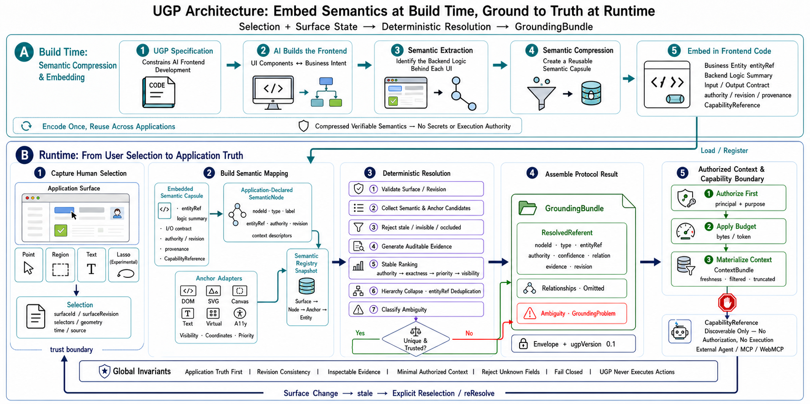

# UI Grounding Protocol

> Preserve application meaning from frontend authoring to human selection and
> independent-agent use.



UI Grounding Protocol (UGP) is a vendor-neutral contract between visible UI and
application-owned meaning. It lets a person point at a card, chart mark, clause,
workflow node, or record and gives an independent agent a compact, structured
description of the exact business referent.

UGP is not a semantic component library and does not ask every component to
contain prose. Profiles and mappings live in a sidecar; a view component keeps
only a typed lifecycle link. The same Core grammar supports BI, documents,
workflows, commerce, and new domains without adding domain-specific top-level
fields.

## Research focus

UGP concentrates on two questions.

### RQ1: semantics-preserving frontend authoring

Can an AI coding agent build a new frontend or minimally retrofit an existing
one while preserving application meaning, functional quality, visual quality,
accessibility, and development efficiency?

The repository provides two authoring Skills:

- `ugp-build` for greenfield work;
- `ugp-retrofit` for minimum-change upgrades of existing applications.

Both produce the same sidecar layout and protocol output. The retrofit Skill
adds baseline capture, source tracing, strict diff control, and an explicit
semantic-gap report.

### RQ2: independent-agent semantic transfer

Does a standardized UGP description improve an independent agent's ability to
recover the selected business referent, understand its state and scope, and
choose a compatible capability across applications and domains?

The confirmatory design fixes a minimal actor loop and compares eight grounding
inputs across two actor models: Vision Only, HTML/AX, a labeled Tree-of-Lens
adaptation, an IAI-P4 operationalization, RAG, read-only MCP Resource, NLWeb
context, and UGP. Equal-fact application-specific prose remains an ablation, not
a claimed published baseline. Published systems that require their own
checkpoint or agent stack are reproduced in a separate native-systems table.

Human-AI shared grounding is a later, separate participant study. Model-only
benchmarks cannot establish human trust, workload, or collaboration quality.

## The semantic round trip

```text
application data and business rules
              |
              v
Profile + typed sidecar Binding
              |
              v
visible component link -----> selection resolver
                                  |
                                  v
                        structured GroundingCapsule
                                  |
                    +-------------+-------------+
                    |                           |
             optional Inspector          host application
             point/region/text        model, tools, policy, audit
```

The existing v0.1 runtime resolves UI evidence into authoritative referents and
keeps diagnostic geometry, ranking evidence, ambiguity, and staleness. The v0.2
research candidate combines that result with an application Binding to produce a
smaller agent-facing `GroundingCapsule`.

## Minimal general grammar

UGP v0.2 uses four concepts:

- `SemanticValue`: scalar, quantity, entity, instant, interval, collection, or
  nested frame;
- `SemanticFrame`: a typed statement with one canonical subject and named roles;
- `ProfileDefinition`: domain vocabulary, role constraints, deterministic
  summary template, and compatible capabilities;
- `GroundingCapsule`: surface revision, structured description, capability
  identifiers, and an optional grounding problem.

Domain meaning belongs in Profile roles. BI can define `metric`, `value`, and
`scope`; a contract Profile can define `effect` and `noticePeriod`; a workflow
Profile can define `state`, `assignee`, and `prerequisite`. None changes Core.

```json
{
  "v": "0.2-draft",
  "id": "capsule:grounding:order-42",
  "at": {
    "surface": "surface:orders",
    "revision": "surface-r1"
  },
  "description": {
    "profile": "profile:commerce",
    "summary": "Order 42 is pending-payment with total 8431 USD.",
    "frame": {
      "type": "commerce.order",
      "subject": {
        "kind": "entity",
        "ref": "orders/42",
        "label": "Order 42"
      },
      "roles": {
        "state": "pending-payment",
        "total": {
          "kind": "quantity",
          "value": 8431,
          "unit": "USD"
        }
      }
    }
  },
  "can": ["commerce.inspect-order"]
}
```

`description.frame` is normative. `description.summary` is generated from the
validated frame and Profile template; it is never a second independently
maintained description. A pointer to a query, API, or resource may expand the
meaning, but cannot replace the immediate structured description.

## Authoring model

Greenfield and retrofit workflows create the same responsibilities:

```text
src/ugp/
  manifest.ts
  profiles/
  bindings/
  capabilities/
  surfaces/
  tests/
```

A Binding maps real application data to stable node identity, a canonical entity
subject, a validated frame, revision, and capability identifiers.

```tsx
function OrderRow({ order }: { order: Order }) {
  const ugp = useUgpLink(orderBinding, order);
  return <button ref={ugp.ref}>Order {order.id}</button>;
}
```

The component does not contain Profile prose, duplicated business JSON, API
routes, credentials, authorization, or model logic. If an authoritative fact
cannot be traced from the domain model, API contract, validated state, or typed
props, the authoring workflow records a semantic gap instead of guessing from
rendered text.

See the [v0.2 authoring contract](spec/drafts/v0.2/AUTHORING.md) and the
repository Skills in [`skills/`](skills/).

## Optional Inspector and host boundary

`@ui-grounding/inspector` is a reference consumer. Its floating UI supports
point, region, and text selection, displays the structured description and raw
Capsule, exposes ambiguity/stale/missing feedback, and hands the result to the
host through `onGrounding`.

The Inspector deliberately has no model loop, chat state, API credentials,
arbitrary fetch logic, business authorization, or action execution. `can`
contains discoverable capability identifiers, not permission. The host resolves
the current adapter and schema, validates arguments, re-authorizes the user,
confirms when required, executes, and owns the audit trail.

## Project status

| Track                               | Status                                                                                                       |
| ----------------------------------- | ------------------------------------------------------------------------------------------------------------ |
| v0.1 grounding protocol and runtime | M5 acceptance passed; accepted baseline                                                                      |
| v0.2 semantic authoring layer       | research draft implemented in schemas, generated types, authoring runtime, React link, and Inspector         |
| authoring Skills                    | `ugp-build` and `ugp-retrofit` created and structurally validated                                            |
| automated research                  | RQ1 preparation complete; v0.3 grounding pilot harness passes, external benchmark and isolation gates remain |
| human-participant research          | not started                                                                                                  |

The v0.2 draft is additive and does not silently change the accepted v0.1 wire
format. See the [research and readiness plan](RESEARCH_PLAN_V0.2.md),
[draft specification](spec/drafts/v0.2/README.md), and
[v0.2 experiment workspace](experiments/semantic-authoring-v02/README.md). The
frozen model-only grounding matrix, benchmark pins, actor protocol, result
tables, and live readiness gates are in the
[v0.3 grounding experiment](experiments/grounding-main-v03/README.md).
Historical Luna runs remain non-inferential calibration in
[`experiments/chi-pilot/`](experiments/chi-pilot/).

## Packages

- `@ui-grounding/protocol` — accepted v0.1 wire types and schemas;
- `@ui-grounding/core` — deterministic registries and selection resolution;
- `@ui-grounding/dom` — DOM anchors and visible geometry;
- `@ui-grounding/react` — surface provider, node links, and `useUgpLink`;
- `@ui-grounding/overlay` — point, region, text, and ambiguity UI primitives;
- `@ui-grounding/authoring` — draft Profiles, Bindings, validation, and Capsule
  compilation;
- `@ui-grounding/inspector` — optional floating reference Inspector;
- `@ui-grounding/testing` — test helpers;
- conformance runner and browser acceptance applications.

## Development

Requires Node.js 22.13 or newer and pnpm 11.19.

```sh
pnpm install --frozen-lockfile
pnpm check
pnpm test:browser
pnpm build
pnpm pack:smoke
pnpm experiment:v02:validate
pnpm experiment:v02:preflight
pnpm experiment:v03:validate
pnpm experiment:v03:preflight
```

`pnpm pack:smoke` packs every public package and tests them in a clean consumer.
The v0.2 preparation commands validate controlled-fact parity, frozen Capsule
fields, Skills, 24 RQ1 starter-condition packets, RQ2 artifacts, 50
deterministic prepare/reset cycles, and four retrofit browser baselines. They do
not invoke an experimental model or convert calibration into evidence. The v0.3
preflight additionally validates the 16-row/80-cell grounding table, official
source pins, fresh actor packets, leakage checks, response sealing,
deterministic scoring, and environment readiness. It allows pilot execution but
keeps confirmatory execution closed until all external, license, calibration,
and hard-isolation gates pass. A clean-machine continuation guide is available
in the [v0.3 handoff](experiments/grounding-main-v03/HANDOFF.md).

See [CONTRIBUTING.md](CONTRIBUTING.md) before opening a change. The accepted
v0.1 roadmap remains in [DEVELOPMENT_PLAN.md](DEVELOPMENT_PLAN.md).

## License

Code is licensed under [Apache-2.0](LICENSE). Specification and documentation
are licensed under [CC BY 4.0](LICENSE-DOCS.md).
